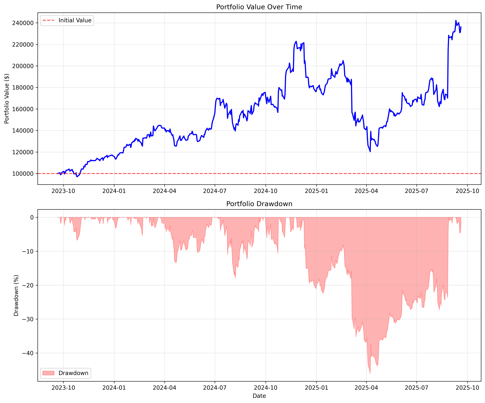
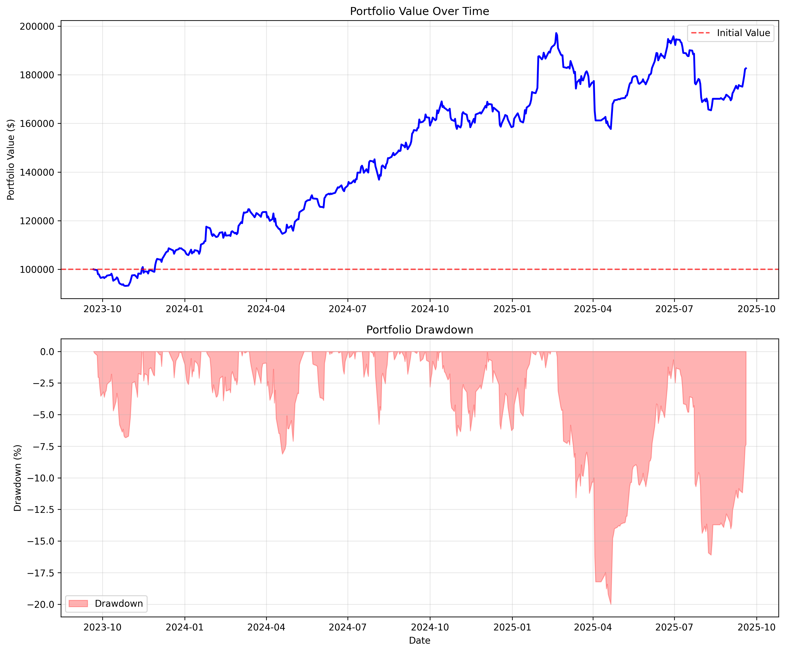

# Trading Algorithms - Part 2

## ARIMA Algorithm

### Combined 3-Indicator Strategy
Advanced trading system combining complementary technical indicators:

**Indicators Used:**
1. **ARIMA** - Time series forecasting (predicts price direction)
2. **Bollinger Bands** - Mean reversion signals (volatility-based)
3. **RSI** - Momentum confirmation (overbought/oversold)

### Trading Logic
- **Multi-Indicator Consensus**: Combines 3 different market perspectives
- **ARIMA**: Forecasts next-day price changes using time series analysis
- **Bollinger Bands**: BUY at lower band (oversold), SELL at upper band (overbought)
- **RSI**: BUY when RSI <30 (oversold), SELL when RSI >70 (overbought)
- **Majority Voting**: Trades only when indicators agree
- **Portfolio Management**: Dynamic rebalancing with position rotation

### How to Run
```bash
# 1. Generate stock data (33 tech stocks, 10 years)
python3 generate_training_data.py

# 2. Train ARIMA models (one per stock)
cd algorithms/ARIMA
python3 train_arima_models.py

# 3. Run combined indicators backtest
python3 ARIMA-RSI-Bollinger-test.py
```

### Requirements
```bash
pip install pandas numpy matplotlib statsmodels yfinance
```

### Expected Output
```
COMBINED 3-INDICATOR STRATEGY RESULTS
Indicators: ARIMA + Bollinger Bands + RSI
=========================================================
Initial Capital: $100,000.00
Final Portfolio Value: $236,150.51
Total Return: 136.15%
Annualized Return: 82.37%
Sharpe Ratio: 1.16
Max Drawdown: -46.01%
Volatility: 41.38%
Estimated Trades: 2952
Trading Days: 522
```

### Files Generated
- `data/arima/models/` - Trained ARIMA models for each stock
- `data/plots/arima_portfolio_performance.png` - Portfolio performance visualization

### Generated Plot
The system creates a dual-panel chart:
- **Top Panel**: Portfolio value over time with initial value reference line
- **Bottom Panel**: Portfolio drawdown periods (risk visualization)
- **Format**: High-resolution PNG (300 DPI) suitable for reports



*ARIMA + RSI + Bollinger Bands Strategy Performance*

### Strategy Advantages
- **Diversified Signals**: Combines trend, volatility, and momentum analysis
- **Risk Management**: Multiple confirmations reduce false signals
- **Adaptive**: Bollinger Bands adjust to market volatility
- **Proven Indicators**: Uses well-established technical analysis tools
- **Capital Efficiency**: Full investment with dynamic rebalancing

### Performance Metrics
- **Total Return**: Overall profit/loss percentage
- **Annualized Return**: Yearly return rate
- **Sharpe Ratio**: Risk-adjusted return (>1.0 is good)
- **Max Drawdown**: Largest portfolio decline (risk measure)
- **Volatility**: Portfolio fluctuation level
- **Trade Count**: Number of buy/sell transactions


## LSTM Algorithm

Using LSTM neural networks combined with technical filters for portfolio management.

**Indicators Used:**
1. **LSTM Prediction** - Sequence model forecasting short-term price direction
2. **MA5 Trends Filter** - Confirms uptrend/downtrend with 5-day moving average
3. **Dynamic Position Sizing** - Invests larger proportion of capital when signals are stronger

### Trading Logic
- **Prediction Signal**: Compare yesterday’s LSTM prediction with today’s actual price.  
- **MA5 Confirmation**: Only buy when the 5-day moving average trend is upward.  
- **Dynamic Position Sizing**:  
  - Strong signal (>5%): invest **40%** of available capital.  
  - Medium signal (>3%): invest **30%**.  
  - Weak signal (>1%): invest **15%**.  
- **Exit Rules**:  
  - Predicted drop (<-2%): full sell.  
  - Profit > +20%: partial sell (50%).  
  - Loss < -7%: stop loss (full exit).  


### How to Run
```bash
# 1. Generate stock data (33 tech stocks, 10 years)
python3 generate_training_data.py

# 2. Train LSTM models (one per stock)
cd algorithms/lstm
python3 lstm_train.py

# 3. Run combined indicators backtest
python3 lstm_test.py
```

### Requirements
```bash
pip install pandas numpy matplotlib scikit-learn tensorflow
```

### Expected Output
```
LSTM STRATEGY RESULTS
Indicators: Precomputed LSTM + MA5 + Stop Loss/Take Profit
==================================================
Initial Capital: $100,000.00
Final Portfolio Value: $182,642.99
Total Return: 82.64%
Annualized Return: 52.38%
Sharpe Ratio: 1.56
Max Drawdown: -20.00%
Volatility: 18.49%
Estimated Trades: 963
Trading Days: 522
```

### Files Generated
- `data/lstm/models/` - Trained LSTM models for each stock
- `data/plots/lstm_portfolio_performance.png` - Portfolio performance visualization

### Generated Plot
The system creates a dual-panel chart:
- **Top Panel**: Portfolio value over time with initial value reference line
- **Bottom Panel**: Portfolio drawdown periods (risk visualization)
- **Format**: High-resolution PNG (300 DPI) suitable for reports


